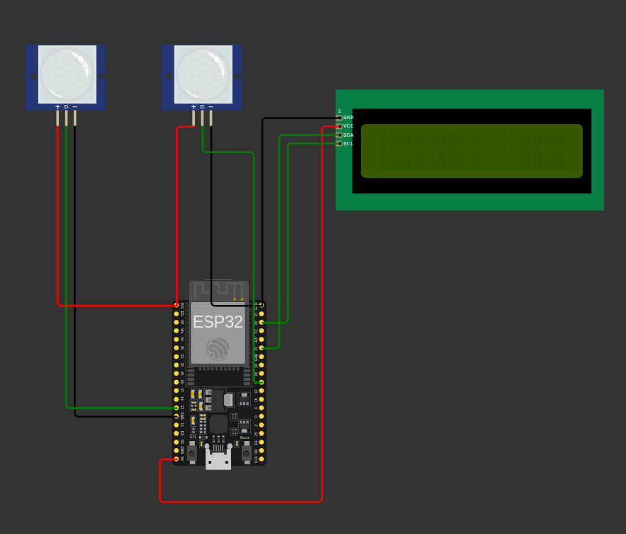

# TrackSence

## Descrição

O TrackSence é um sistema embarcado para contagem de pessoas utilizando o microcontrolador ESP32, sensores de movimento e um display LCD com comunicação I2C. O sistema é capaz de identificar se uma pessoa entrou ou saiu de um ambiente com base na ordem de ativação dos sensores, mantendo um contador atualizado em tempo real.

Este projeto foi desenvolvido para a disciplina de Sistemas Embarcados.

---

## Objetivo

Desenvolver um sistema embarcado capaz de:

* Detectar movimento de pessoas
* Identificar entrada e saída
* Contabilizar o número de pessoas em um ambiente
* Exibir o número de pessoas em um display LCD
* Registrar eventos no monitor serial

---

## Componentes Utilizados

* ESP32
* 2 Sensores de movimento PIR
* Display LCD 16x2 com módulo I2C
* Jumpers
* Simulação no Wokwi
* Linguagem C++

---

## Diagrama do Circuito



---

## Funcionamento do Sistema

O sistema utiliza dois sensores posicionados na entrada de um ambiente.
A lógica de funcionamento é baseada na ordem em que os sensores são ativados:

| Ordem dos Sensores  | Ação          |
| ------------------- | ------------- |
| Sensor A → Sensor B | Pessoa entrou |
| Sensor B → Sensor A | Pessoa saiu   |

O sistema incrementa ou decrementa o contador e mostra o valor atualizado no display LCD e no monitor serial.

---

## Estrutura do Projeto

```
TrackSence/
│
├── src/
│   └── tracksence.ino
│
├── images/
│   └── circuito.png
│
└── README.md
```

---

## Como Executar o Projeto

1. Instalar a Arduino IDE / WOKWI
2. Instalar as bibliotecas:

   * Wire.h
   * LiquidCrystal_I2C.h
3. Selecionar a placa ESP32
4. Conectar os sensores nos pinos:

   * Sensor A → GPIO 12
   * Sensor B → GPIO 5
5. Conectar o LCD I2C:

   * SDA → GPIO 21
   * SCL → GPIO 22
6. Compilar e enviar o código para o ESP32
7. Abrir o Serial Monitor para visualizar os logs

---

## Lógica do Código

O programa realiza:

* Leitura dos sensores digitais
* Verificação da sequência de ativação
* Incremento do contador para entrada
* Decremento do contador para saída
* Impede que o contador fique negativo
* Mostra o valor no LCD
* Mostra logs no Serial Monitor

---

## Possíveis Melhorias Futuras

* Envio de dados via WiFi
* Dashboard Web
* Banco de dados
* Gráfico de fluxo de pessoas
* Limite máximo de pessoas
* Aplicativo mobile
* Sistema de alerta de lotação
* Armazenamento em nuvem

---

## Autores

Alyson Thadeu
Anthony Rychard
Maria Heloísa
Projeto de Sistemas Embarcados
Curso de ADS / Ciência da Computação

---

## Licença

Este projeto é apenas para fins educacionais.
